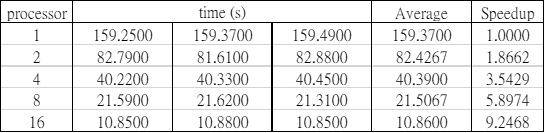
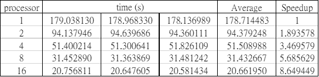
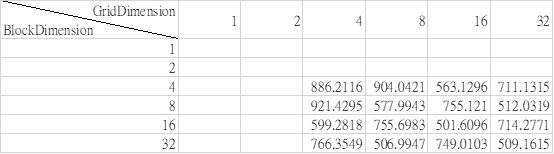
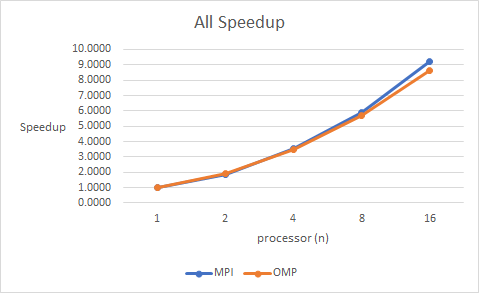
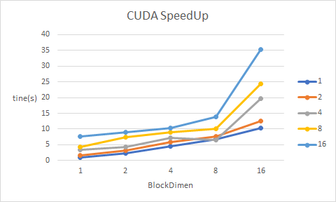

### Parallel Merge Sort

#### Using three parallel library includes: OMP MPI CUDA to implement parallel merge sort.

##### feature

​	Randomly generate 1,000,000,000 numbers between 0~100 and 

​	Using three different parallel method to implement the merge sort.

##### Statistic

MPI statistics

OMP statistics

CUDA statistic

Speedup Comparison

